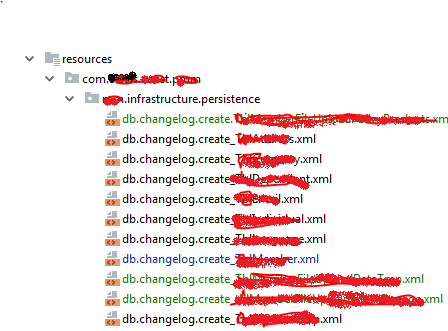
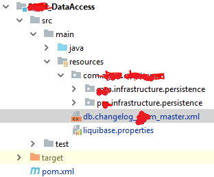
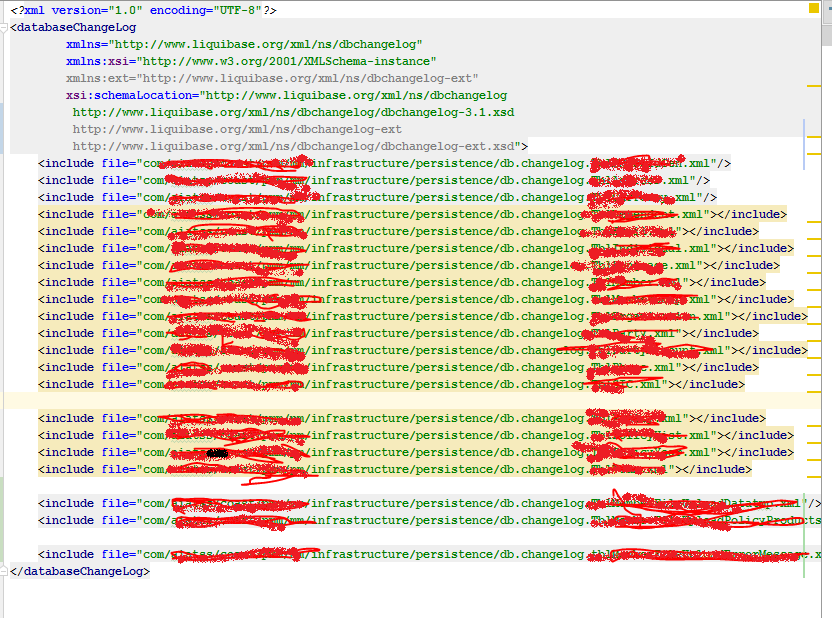
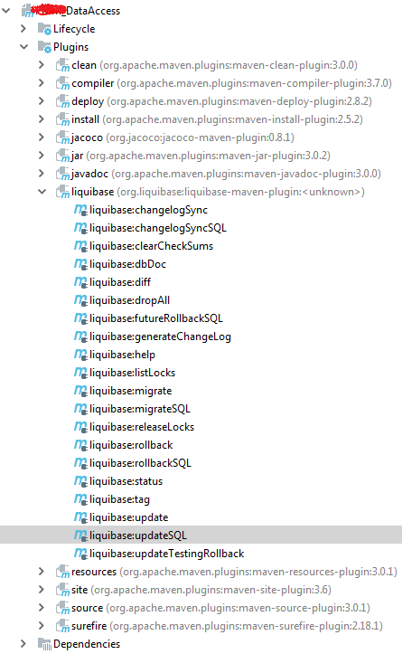

* summary
* create a database change log file
* include change log file into comprehensive file
* using db.changelog_master.xml file to aggregate change log file
* liquibase.properties
* liquibase maven plugin
* load data  by csv


### create a database change log file

In liquibase , using many db change log file for maintaining db meta-data or  structure   , These db change log includes  database operation of DDL , These db change log file would resides in resources directory , like below. 



A change log file is a XML format file . The root element and xml schema is below:

```xml
<?xml version="1.0" encoding="UTF-8"?>
<databaseChangeLog
        xmlns="http://www.liquibase.org/xml/ns/dbchangelog"
        xmlns:xsi="http://www.w3.org/2001/XMLSchema-instance"
        xsi:schemaLocation="http://www.liquibase.org/xml/ns/dbchangelog
         http://www.liquibase.org/xml/ns/dbchangelog/dbchangelog-3.1.xsd">

</databaseChangeLog> 

```

When i want to create a new table named as `TblLiquibaseTest` , then i create a database change log xml file named as `db.changelog.create.TblLiquibaseTest.xml` placed into resources directory , The xml content is showing below:

```xml
<?xml version="1.0" encoding="UTF-8"?>
<databaseChangeLog
        xmlns="http://www.liquibase.org/xml/ns/dbchangelog"
        xmlns:xsi="http://www.w3.org/2001/XMLSchema-instance"
        xsi:schemaLocation="http://www.liquibase.org/xml/ns/dbchangelog
         http://www.liquibase.org/xml/ns/dbchangelog/dbchangelog-3.1.xsd">

    <changeSet id="createtion-com.ai**ss.c**st.AppTest.LiquibaseTest" author="AndyLi">
        <createTable tableName="TblLiquibaseTest">
            <column name="testId" type="java.sql.Types.BIGINT">
                <constraints nullable="false" primaryKey="true"></constraints>
            </column>
            <column name="testName" type="java.sql.Types.VARCHAR(50)">
                <constraints nullable="true"></constraints>
            </column>
            <column name="createDate" type="java.sql.Types.TIMESTAMP"></column>
            <column name="status" type="java.sql.Types.CHAR(1)"></column>
        </createTable>
    </changeSet>


</databaseChangeLog>
```
1. `databaseChangeLog` is the root element of database change log xml
2. `chanageSet` is an operation of DDL
3. `changeSet.id` `changeSet.author` is a unique identification using by liuqibase to identify which operation has been committed or not .  

### comprehensive file

In the same directory with `db.changelog.create.TblLiquibaseTest.xml` , i created comprehensive file `db.changelog.TblLiquibaseTest.xml` to include `db.changelog.create.TblLiquibaseTest.xml` in order to maintain familial change log file.

```xml

<?xml version="1.0" encoding="UTF-8"?>
<databaseChangeLog
        xmlns="http://www.liquibase.org/xml/ns/dbchangelog"
        xmlns:xsi="http://www.w3.org/2001/XMLSchema-instance"
        xsi:schemaLocation="http://www.liquibase.org/xml/ns/dbchangelog
         http://www.liquibase.org/xml/ns/dbchangelog/dbchangelog-3.1.xsd">
    <include file="com/xx/xx/infrastructure/persistence/db.changelog.create.TblLiquibaseTest.xml"/>
</databaseChangeLog>

```

### db.changelog_master.xml

Using `db.change.master.xml` to aggregated all change log files for liquibase to maintain database . Also the file should be placed in resources directory . The directory structure like below:



The `db.change.master.xml` content contains many `include` elements to aggregate all change files , like this:



Since i create the comprehensive file `db.changelog.TblLiquibaseTest.xml` for familial operation of table `TblLiquibaseTest` DDL , i must supplement below tag statement into `db.change.master.xml`

```xml

<include file="com/axxs/cxxst/pxm/xm/infrastructure/persistence/db.changelog.TblLiquibaseTest.xml"/>

```

### liquibase.properties

Liquibase used properties file to configure running . A `liquibase.properties`  should be placed in resources directory 


 The content of `liquibase.properties`

```properties
contexts=dbUt
changeLogFile=db.changelog_p**m_master.xml
driver: com.microsoft.sqlserver.jdbc.SQLServerDriver
url: jdbc:sqlserver://localhost:1433;DatabaseName=XXXPOC
username: sa
password: ***
verbose: true
dropFirst: false
outputChangeLogFile: db.changelog_pxx_ouput.xml

```
1. `dropFirst` configure whether delete all table before running 

### liuqibase maven plugin

```xml
 <plugin>
   <groupId>org.liquibase</groupId>
   <artifactId>liquibase-maven-plugin</artifactId>
   <configuration>
        <propertyFileWillOverride>true</propertyFileWillOverride>
        <propertyFile>src/main/resources/liquibase.properties</propertyFile>
        <promptOnNonLocalDatabase>false</promptOnNonLocalDatabase>
        <executions>
              <execution>
                    <phase>process-resources</phase>
                    <goals>
                        <goal>updateSQL</goal>
                     </goals>
              </execution>
         </executions>
   </configuration>
</plugin>
```
1. Because of using spring boot default liquibase version , i have no specified `version` of `liquibase-maven-plugin` plugin
2. `propertyFile` specified the `liquibase.properties` location 
3.  `promptOnNonLocalDatabase` is false will configure that not prompt confirm message when conecting to database

After configure maven plugin ,then you will see the plugin information in `Maven Project` view of `iNTELLIj IDEA`



1. `liquibase:update` Run liquibase and applies the database change logs to the databalse direct. Useful as part of the build process.
2. `liquibase:updateSQL` Generates the SQL that is required to update the database to the current version as spcified in the database change logs .

In real ,since i added `db.changelog.create.TblLiquibaseTest.xml`  to project . but  i do not want to applies the `db.changelog.create.TblLiquibaseTest.xml` to the database direct , i want to generate the SQL script for check and approval before database change log be applied. We can bundle plugin goal `liquibase:updateSQL` to maven phase like above configuration  , and then we run command `mvn package`  to generate the script .

For comparing , i has ran `mvn package` before i composed `db.changelog.create.TblLiquibaseTest.xml` to get the scirpt in the case of no change of database. So i got the scirpt below in the directory `target\liquibase\migrate.sql` :

```sql
-- *********************************************************************
-- Update Database Script
-- *********************************************************************
-- Change Log: db.changelog_p*m_master.xml
-- Ran at: 8/16/18 10:23 AM
-- Against: sa@jdbc:sqlserver://CANW***3X:1433;authenticationScheme=nativeAuthentication;xopenStates=false;sendTimeAsDatetime=true;trustServerCertificate=false;sendStringParametersAsUnicode=true;selectMethod=direct;responseBuffering=adaptive;packetSize=8000;multiSubnetFailover=false;loginTimeout=15;lockTimeout=-1;lastUpdateCount=true;encrypt=false;disableStatementPooling=true;databaseName=C**TPOC;applicationName=Microsoft JDBC Driver for SQL Server;applicationIntent=readwrite;
-- Liquibase version: 3.6.1
-- *********************************************************************

USE C**TPOC;
GO

-- Lock Database
UPDATE DATABASECHANGELOGLOCK SET LOCKED = 1, LOCKEDBY = 'CAxxxR43X (10.xx.xx.100)', LOCKGRANTED = '2018-08-16T10:23:59.369' WHERE ID = 1 AND LOCKED = 0
GO

-- Release Database Lock
UPDATE DATABASECHANGELOGLOCK SET LOCKED = 0, LOCKEDBY = NULL, LOCKGRANTED = NULL WHERE ID = 1
GO


```

The script show that have nothing to do

Then i ran again after i composed the `db.changelog.create.TblLiquibaseTest.xml` , I got the script in the same directory.

```SQL
-- *********************************************************************
-- Update Database Script
-- *********************************************************************
-- Change Log: db.changelog_p*m_master.xml
-- Ran at: 8/16/18 4:23 PM
-- Against: sa@jdbc:sqlserver://CANW**X:1433;authenticationScheme=nativeAuthentication;xopenStates=false;sendTimeAsDatetime=true;trustServerCertificate=false;sendStringParametersAsUnicode=true;selectMethod=direct;responseBuffering=adaptive;packetSize=8000;multiSubnetFailover=false;loginTimeout=15;lockTimeout=-1;lastUpdateCount=true;encrypt=false;disableStatementPooling=true;databaseName=C**TPOC;applicationName=Microsoft JDBC Driver for SQL Server;applicationIntent=readwrite;
-- Liquibase version: 3.6.1
-- *********************************************************************

USE C**TPOC;
GO

-- Lock Database
UPDATE DATABASECHANGELOGLOCK SET LOCKED = 1, LOCKEDBY = 'CANWKD3**3X (10.*.*.100)', LOCKGRANTED = '2018-08-16T16:23:58.314' WHERE ID = 1 AND LOCKED = 0
GO

-- Changeset com/a***s/co**t/p*m/*m/infrastructure/persistence/db.changelog.create.TblLiquibaseTest.xml::createtion-com.a**s.c**t.AppTest.LiquibaseTest::AndyLi
CREATE TABLE TblLiquibaseTest (testId bigint NOT NULL, testName varchar(50), createDate datetime, status char(1), CONSTRAINT PK_TBLLIQUIBASETEST PRIMARY KEY (testId))
GO

INSERT INTO DATABASECHANGELOG (ID, AUTHOR, FILENAME, DATEEXECUTED, ORDEREXECUTED, MD5SUM, DESCRIPTION, COMMENTS, EXECTYPE, CONTEXTS, LABELS, LIQUIBASE, DEPLOYMENT_ID) VALUES ('createtion-com.ai**s.c**t.AppTest.LiquibaseTest', 'AndyLi', 'com/a**s/c**st/p*m/*m/infrastructure/persistence/db.changelog.create.TblLiquibaseTest.xml', GETDATE(), 77, '8:166d6aa5138bc6e4f47c51458761f0ad', 'createTable tableName=TblLiquibaseTest', '', 'EXECUTED', NULL, NULL, '3.6.1', '4407838779')
GO

-- Release Database Lock
UPDATE DATABASECHANGELOGLOCK SET LOCKED = 0, LOCKEDBY = NULL, LOCKGRANTED = NULL WHERE ID = 1
GO
```

Compaing the script with previous script , we found that a table creaton operation DDL SQL had generated as expected . We can apply the script to database after checking and approval

For  executing flexibly ,  i can compose tow mavne profiles in `pom.xml` 

```xml
<profiles>
    <profile>
        <id>local</id>
        <activation>
            <activeByDefault>true</activeByDefault>
        </activation>
        <properties>
            <liquibase.exec.goal>update</liquibase.exec.goal>
            <liquibase.exec.prompt>false</liquibase.exec.prompt>
            <liquibase.db.url>jdbc:oracle:thin:@host:1521:xe</liquibase.db.url>
            <liquibase.db.user>user</liquibase.db.user>
            <liquibase.db.password>password</liquibase.db.password>
        </properties>
    </profile>

    <profile>
        <id>uat</id>
        <properties>
            <liquibase.exec.goal>updateSQL</liquibase.exec.goal>
            <liquibase.exec.prompt>true</liquibase.exec.prompt>
            <liquibase.db.url>jdbc:oracle:thin:@host2:1521:xe</liquibase.db.url>
            <liquibase.db.user>user2</liquibase.db.user>
            <liquibase.db.password>password2</liquibase.db.password>
        </properties>
    </profile>
</profiles>
```

And update the plugin to like below,

```xml

<plugin>
    <groupId>org.liquibase</groupId>
    <artifactId>liquibase-maven-plugin</artifactId>
    <version>3.0.5</version>
    <configuration>
        <changeLogFile>src/main/resources/db/liquibase_changeset.xml</changeLogFile>
        <driver>oracle.jdbc.driver.OracleDriver</driver>
        <url>${liquibase.db.url}</url>
        <username>${liquibase.db.user}</username>
        <password>${liquibase.db.password}</password>
        <promptOnNonLocalDatabase>false</promptOnNonLocalDatabase>
    </configuration>
    <executions>
        <execution>
            <phase>process-resources</phase>
            <goals>
                <goal>${liquibase.exec.goal}</goal>
            </goals>
        </execution>
    </executions>
</plugin>

```

After above , we can use `mvn insatll -P local` or `mvn install -P uat` in difference envrionment 

### load data by csv

We can use liquibase for loading data into database.
First , create a database change log named as `db.changelog.insert.TblLiquibaseTest.xml` , and place into the same directory as `db.changelog.create.TblLiquibaseTest.xml` , and the content is below.

```xml

<?xml version="1.0" encoding="UTF-8"?>
<databaseChangeLog
        xmlns="http://www.liquibase.org/xml/ns/dbchangelog"
        xmlns:xsi="http://www.w3.org/2001/XMLSchema-instance"
        xsi:schemaLocation="http://www.liquibase.org/xml/ns/dbchangelog
         http://www.liquibase.org/xml/ns/dbchangelog/dbchangelog-3.1.xsd">

    <changeSet id="insertdata-com.a**s.c**t.AppTest.LiquibaseTest" author="AndyLi">
        <loadUpdateData tableName="TblLiquibaseTest" primaryKey="testId" file="om/a**ss/c**st/p*m/*m/infrastructure/persistence/TblLiquibaseTest.csv">
            <column type="NUMERIC" name="testId"></column>
            <column type="STRING" name="testName"></column>
            <column name="createDate" type="DATE"></column>
            <column type="STRING" name="status"></column>
        </loadUpdateData>

    </changeSet>

</databaseChangeLog>

```  

Second , create a  csv named as `TblLiquibaseTest.csv` , and place into the same directory as `db.changelog.insert.TblLiquibaseTest.xml` , and composed data into `TblLiquibaseTest.csv` 

```txt
testId,testName,createDate,status
1,name-1,2018-08-16,A
2,name-2,2018-08-16,A
3,name-3,2018-08-16,A


```

Third , add the `db.changelog.insert.TblLiquibaseTest.xml` file path into `db.changelog.TblLiquibaseTest.xml` , let liquibase can locate the database change log

```xml
<?xml version="1.0" encoding="UTF-8"?>
<databaseChangeLog
        xmlns="http://www.liquibase.org/xml/ns/dbchangelog"
        xmlns:xsi="http://www.w3.org/2001/XMLSchema-instance"
        xsi:schemaLocation="http://www.liquibase.org/xml/ns/dbchangelog
         http://www.liquibase.org/xml/ns/dbchangelog/dbchangelog-3.1.xsd">
    <include file="com/a**s/c**t/p**m/m**/infrastructure/persistence/db.changelog.create.TblLiquibaseTest.xml"/>
    <include file="com/a**s/**st/p*m/m*/infrastructure/persistence/db.changelog.insert.TblLiquibaseTest.xml"/>
</databaseChangeLog>
``` 

Fourth , run maven command to generate script `mvn package` , and execute the script in database to applies database change log

```sql

-- *********************************************************************
-- Update Database Script
-- *********************************************************************
-- Change Log: db.changelog_p**m_master.xml
-- Ran at: 8/16/18 7:14 PM
-- Against: sa@jdbc:sqlserver://CAN****43X:1433;authenticationScheme=nativeAuthentication;xopenStates=false;sendTimeAsDatetime=true;trustServerCertificate=false;sendStringParametersAsUnicode=true;selectMethod=direct;responseBuffering=adaptive;packetSize=8000;multiSubnetFailover=false;loginTimeout=15;lockTimeout=-1;lastUpdateCount=true;encrypt=false;disableStatementPooling=true;databaseName=C**TPOC;applicationName=Microsoft JDBC Driver for SQL Server;applicationIntent=readwrite;
-- Liquibase version: 3.6.1
-- *********************************************************************

USE C**TPOC;
GO

-- Lock Database
UPDATE DATABASECHANGELOGLOCK SET LOCKED = 1, LOCKEDBY = 'CA***43X (10.65.35.100)', LOCKGRANTED = '2018-08-16T19:14:16.857' WHERE ID = 1 AND LOCKED = 0
GO

-- Changeset com/ai**s/c**t/p**m/**m/infrastructure/persistence/db.changelog.create.TblLiquibaseTest.xml::createtion-com.a**s.c**st.AppTest.LiquibaseTest::AndyLi
CREATE TABLE TblLiquibaseTest (testId bigint NOT NULL, testName varchar(50), createDate datetime, status char(1), CONSTRAINT PK_TBLLIQUIBASETEST PRIMARY KEY (testId))
GO

INSERT INTO DATABASECHANGELOG (ID, AUTHOR, FILENAME, DATEEXECUTED, ORDEREXECUTED, MD5SUM, DESCRIPTION, COMMENTS, EXECTYPE, CONTEXTS, LABELS, LIQUIBASE, DEPLOYMENT_ID) VALUES ('createtion-com.ai**s.c**st.AppTest.LiquibaseTest', 'AndyLi', 'com/a**ss/c**t/p**m/**m/infrastructure/persistence/db.changelog.create.TblLiquibaseTest.xml', GETDATE(), 77, '8:166d6aa5138bc6e4f47c51458761f0ad', 'createTable tableName=TblLiquibaseTest', '', 'EXECUTED', NULL, NULL, '3.6.1', '4418057268')
GO

-- Changeset com/a**s/c**st/p**m/**m/infrastructure/persistence/db.changelog.insert.TblLiquibaseTest.xml::insertdata-com.a**ss.c**st.AppTest.LiquibaseTest::AndyLi
-- WARNING The following SQL may change each run and therefore is possibly incorrect and/or invalid:
DECLARE @reccount integer
SELECT @reccount = count(*) FROM TblLiquibaseTest WHERE testId = 1
IF @reccount = 0
BEGIN
INSERT INTO TblLiquibaseTest (testId, testName, createDate, status) VALUES (1, 'name-1', '2018-08-16', 'A');
END
ELSE
BEGIN
UPDATE TblLiquibaseTest SET createDate = '2018-08-16', status = 'A', testName = 'name-1' WHERE testId = 1;
END
GO

DECLARE @reccount integer
SELECT @reccount = count(*) FROM TblLiquibaseTest WHERE testId = 2
IF @reccount = 0
BEGIN
INSERT INTO TblLiquibaseTest (testId, testName, createDate, status) VALUES (2, 'name-2', '2018-08-16', 'A');
END
ELSE
BEGIN
UPDATE TblLiquibaseTest SET createDate = '2018-08-16', status = 'A', testName = 'name-2' WHERE testId = 2;
END
GO

DECLARE @reccount integer
SELECT @reccount = count(*) FROM TblLiquibaseTest WHERE testId = 3
IF @reccount = 0
BEGIN
INSERT INTO TblLiquibaseTest (testId, testName, createDate, status) VALUES (3, 'name-3', '2018-08-16', 'A');
END
ELSE
BEGIN
UPDATE TblLiquibaseTest SET createDate = '2018-08-16', status = 'A', testName = 'name-3' WHERE testId = 3;
END
GO

INSERT INTO DATABASECHANGELOG (ID, AUTHOR, FILENAME, DATEEXECUTED, ORDEREXECUTED, MD5SUM, DESCRIPTION, COMMENTS, EXECTYPE, CONTEXTS, LABELS, LIQUIBASE, DEPLOYMENT_ID) VALUES ('insertdata-com.a**tss.c**st.AppTest.LiquibaseTest', 'AndyLi', 'com/a**tss/c**st/p**m/m**/infrastructure/persistence/db.changelog.insert.TblLiquibaseTest.xml', GETDATE(), 78, '8:5c6743a4503734b3763b0ef1330edccd', 'loadUpdateData tableName=TblLiquibaseTest', '', 'EXECUTED', NULL, NULL, '3.6.1', '4418057268')
GO

-- Release Database Lock
UPDATE DATABASECHANGELOGLOCK SET LOCKED = 0, LOCKEDBY = NULL, LOCKGRANTED = NULL WHERE ID = 1
GO


```